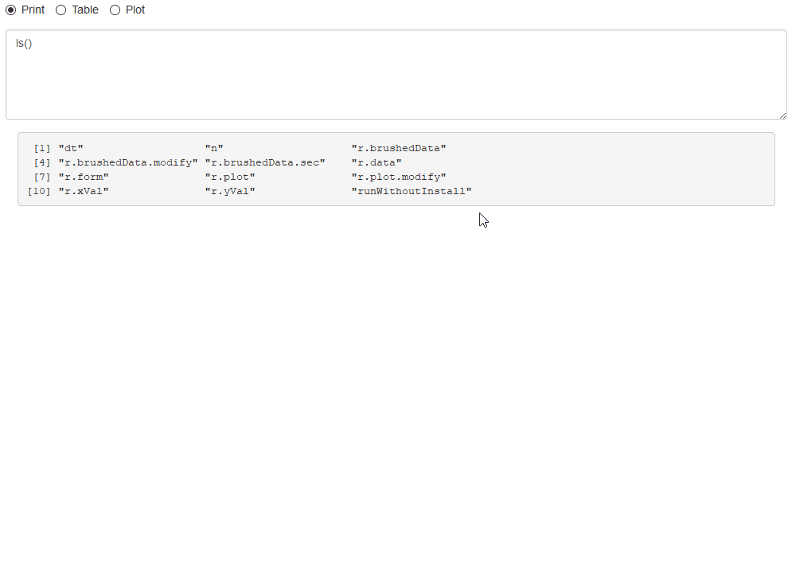
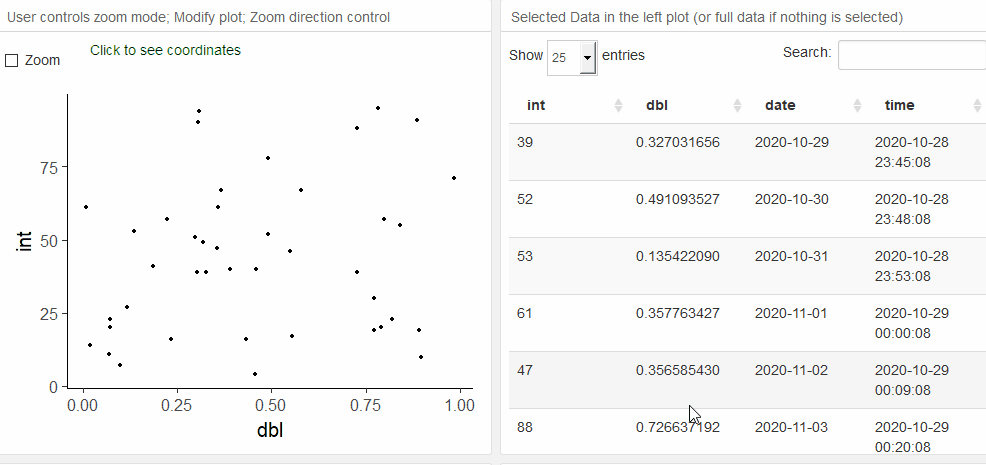
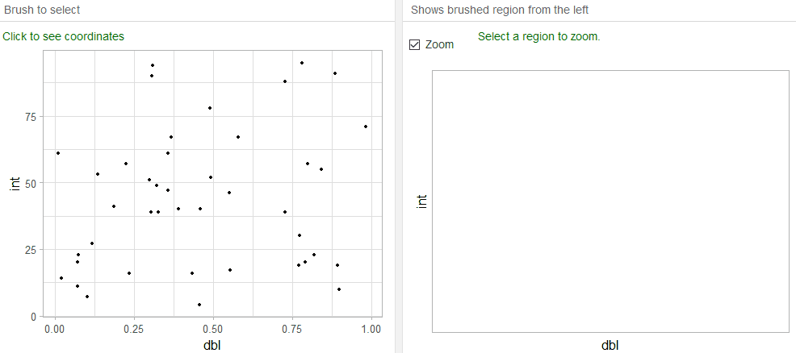
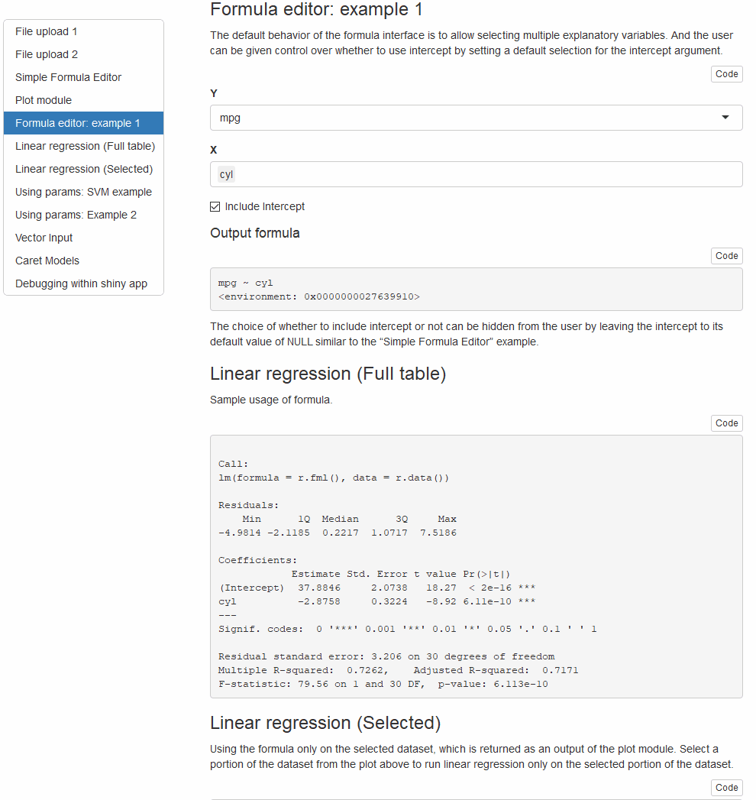

# shinypipe
R Package for shiny modules to be used as reusable components for building data-science related apps. 

Installation:
```r
devtools::install_github("rajkar86/shinypipe")
```

I created this package because I was finding these modules useful for my own projects. Some examples of the reusable modules in this package are shown below as demos. More examples are available in the vignettes.

## Selected Demos

### Develop/Debug from within the shiny app

- This particularly helps me build the app in small chunks without having to render the whole app for every change.



### Plot examples
- Some common plot functionality like zoom and select using just shiny and ggplot.



- Another example with zoom functionality disabled  



### Formula editor
- Useful in any regression/classification setting


